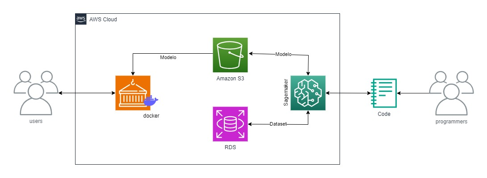

## 🌐 Sobre o Projeto!

Este projeto consiste na criação de um serviço de machine learning para classificação de preços de reserva em hotéis, utilizando o Hotel Reservations Dataset. O modelo foi treinado com o SageMaker da AWS, rodando localmente e a inferência foi feita por meio de uma API desenvolvida em Python. 

***

# Construção do Modelo

O [Hotel Reservations Dataset](https://www.kaggle.com/datasets/ahsan81/hotel-reservations-classification-dataset) contém informações sobre reservas em hotéis e será utilizado para classificar os dados por faixa de preços. A equipe criou uma nova coluna chamada `label_avg_price_per_room` para categorizar as reservas em três faixas de preço:

1. `1` para `avg_price_per_room` ≤ 85
2. `2` para 85 < `avg_price_per_room` < 115
3. `3` para `avg_price_per_room` ≥ 115

O dataset original e o processado foram armazenados no AWS RDS e o modelo treinado foi salvo no S3.

***

## 📂 Estrutura do Repositório
    ├── assets/                          # Diretório para armazenar ativos como imagens usadas no README
    │   └── sprint4-5.jpg                # Imagem usada no README
    ├── src/                             # Diretório que armazena o código-fonte do projeto
    │   ├── api/                         # Diretório para o código do serviço de inferência
    │   │   ├── app/                     # Subdiretório contendo os principais componentes da aplicação
    │   │   │   ├── main.py              # Ponto de entrada da aplicação FastAPI
    │   │   │   ├── controllers.py       # Arquivo contendo a lógica de controle da aplicação
    │   │   │   ├── models.py            # Arquivo contendo o carregamento e gerenciamento do modelo
    │   │   │   └── views.py             # Arquivo contendo as rotas/endpoints da aplicação
    │   │   ├── docker-compose.yml       # Arquivo de configuração do Docker Compose para orquestração de contêineres
    │   │   ├── Dockerfile               # Arquivo para definição da imagem Docker da aplicação
    │   │   ├── requirements.txt         # Lista de dependências Python necessárias para o serviço de inferência
    │   ├── python/                      # Diretório para scripts Python auxiliares e notebooks
    │   │   ├── sagemaker/               # Subdiretório para scripts relacionados ao Amazon SageMaker
    │   │   │   ├── Treinamento.ipynb    # Notebook para treinamento do modelo no SageMaker
    │   │   │   └── requirements.txt     # Lista de dependências Python necessárias para o treinamento no SageMaker
    │   │   ├── scripts/                 # Subdiretório para scripts de manipulação de dados
    │   │   │   ├── csv_to_rds.ipynb     # Notebook para converter CSV para RDS
    │   │   │   ├── rds_to_csv.ipynb     # Notebook para converter RDS para CSV
    │   │   │   └── requirements.txt     # Lista de dependências Python necessárias para os scripts de manipulação de dados
    ├── .gitignore                       # Arquivo para especificar quais arquivos/diretórios o Git deve ignorar
    └── README.md                        # Documentação do projeto
    

## 🔧 Pré-requisitos

`Python 3.11`, `AWS CLI`, `Jupyter Notebook` e `Docker`

***

## 🚀 Como Usar

1. Em uma instância EC2, execute os seguintes comandos para instalar git e docker:
    ```bash
    sudo yum update -y
    sudo yum install git -y
    sudo yum install docker -y
    sudo systemctl start docker
    sudo systemctl enable docker
    sudo curl -L "https://github.com/docker/compose/releases/download/$(curl -s https://api.github.com/repos/docker/compose/releases/latest | grep 'tag_name' | cut -d" -f4)/docker-compose-$(uname -s)-$(uname -m)" -o /usr/local/bin/docker-compose
    sudo chmod +x /usr/local/bin/docker-compose
    ```

2. Crie a pasta .aws para inserir suas credenciais:
    ```bash
    curl "https://awscli.amazonaws.com/awscli-exe-linux-x86_64.zip" -o "awscliv2.zip"
    unzip awscliv2.zip
    sudo ./aws/install
    mkdir -p ~/.aws
    cd ~/.aws/
    nano config 
    nano credentials
    ```
    
3. Clone o repositório:
    ```bash
    git clone "https://github.com/Compass-pb-aws-2024-ABRIL/sprints-4-5-pb-aws-abril.git"
    git checkout grupo-1
    ```

4. Crie um ambiente virtual:
    ```bash
    Em linux:
        pip install virtualenv virtualenvwrapper
        python3 .11 -m venv nome_do_ambiente
        source nome_do_ambiente/bin/activate

    Em Windows:
        pip install virtualenv virtualenvwrapper-win
        mkvirtualenv nome_do_ambiente -p python3.11
    ```

### Usando Python

3. Instale as dependências:
    ```bash
    pip install -r requirements.txt
    ```

4. Execute a API:
    ```bash
    python src/api/app.py
    ```
    
5. Acesse a API:
   ```bash
   http://localhost:8000/docs
    ```

### Usando Docker

3. Construa a Imagem Docker:
    ```bash
    docker build -t nome-da-imagem .
    ```

4. Execute o Container Docker:
    ```bash
    docker run -d -p 8000:8000 nome-da-imagem
    ```
    
5. Acesse a API:
   ```bash
   http://localhost:8000/docs
    ```


***


## Diagrama de Arquitetura AWS

Diagrama de arquitetura da aplicação na AWS.



***


## ✅ Tecnologias utilizadas

- `AWS - Sagemaker`
- `AWS - EC2`
- `AWS - S3`
- `AWS - RDS`
- `FastAPI`
- `Anaconda`
- `Jupyter`
- `Python`
- `MySQL`

***


## ❌ Dificuldades

- Lidar com a integração entre SageMaker, S3 e RDS.
- Rodar SageMaker em local mode

***


## 👨‍💻 Autores

- [José Acerbi Almeida Neto](https://github.com/JoseJaan)
- [Luiz Fillipe Oliveira Morais](https://github.com/LuizFillipe1)
- [Gustavo Henrique Vago Brunetti](https://github.com/GustavoBrunetti)
- [Rafael Alves Silva Rezende](https://github.com/rafa-rez)

***


